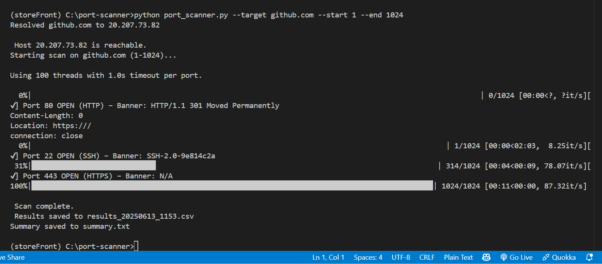
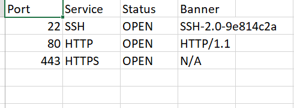

# 🔍 PortVista – Advanced CLI Port Scanner

> A multithreaded Python-based TCP port scanner with DNS resolution, host availability check, and banner grabbing. Designed for developers, network engineers, and security learners.


---

## ✨ Features

- ✅ Scan any IP or domain for open TCP ports  
- 🌐 Supports domain name resolution (e.g., `github.com`)  
- 📶 Host availability check using `ping`  
- ⚡ Multithreaded scanning for fast results  
- 🛡️ Banner grabbing from open services (e.g., SSH, HTTP)  
- 📄 CSV and TXT summary exports  
- 🧠 Detects common services like HTTP, HTTPS, SSH, FTP, etc.  

---

## 🖼️ Screenshots

### Terminal Output  


### CSV Output  


---

## 🖥️ Example Output

```bash
$ python port_scanner.py --target github.com --start 1 --end 1024

Resolved github.com to 140.82.113.4  
Host 140.82.113.4 is reachable.  
Starting scan on github.com (1–1024)...

[✔] Port 22 OPEN (SSH) – Banner: SSH-2.0-OpenSSH_8.2  
[✔] Port 80 OPEN (HTTP) – Banner: Server: GitHub.com  
[✔] Port 443 OPEN (HTTPS) – Banner: Server: GitHub Secure

Scan complete.  
📁 Results saved to results_20240611_1545.csv  
📝 Summary saved to summary_20240611_1545.txt  
```

---

##  🛠️  How to Run 

```bash
# Basic usage
python port_scanner.py --target scanme.nmap.org

# Specify a port range
python port_scanner.py --target github.com --start 20 --end 1024

# Custom thread count and timeout
python port_scanner.py --target github.com --threads 200 --timeout 2.0

# Custom output file
python port_scanner.py --target github.com --output myscan.csv
```

---

## 📁 Output Files

* `results_<timestamp>.csv` – Full list of open ports, service names, and banners
* `summary_<timestamp>.txt` – Human-readable scan summary

---

## 🔍 Use Cases

* 🎓 Hands-on learning of network protocols and port behavior
* 🧪 Internal dev environment scanning and service verification
* 🛡️ Basic vulnerability awareness and exposure checks
* 🧰 A lightweight, CLI-based alternative to Nmap for basic scans

---

## 📚 Technologies Used

* Python 3.8+
* `socket`, `threading`, `subprocess`, `argparse`, `csv`
* `tqdm` for scan progress visualization

---

## ⚠️ Disclaimer

This tool is intended **only for ethical and educational purposes**.

* 🔒 Do not scan systems or IPs that you do not own or have explicit permission to test.
* 👨‍⚖️ The author is **not responsible** for misuse or legal consequences of unethical scanning.

---

## 🧑‍💻 Author

Made by **Haard Shingala**
🎓 B.Tech in Computer Engineering – PDEU
🔗 [LinkedIn](https://www.linkedin.com/in/haard-shingala)
📁 [GitHub](https://github.com/haardshingala)


